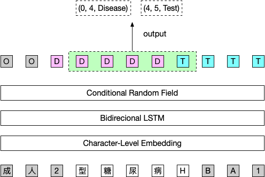

# 瑞金医院MMC人工智能辅助构建知识图谱大赛 (第一赛季)

[竞赛链接](https://tianchi.aliyun.com/competition/introduction.htm?raceId=231687)

> :warning: 由于可能存在的版权问题，请自行联系大赛主办方索要数据，在 Issues 中索要数据的请求将不再回复，谢谢!
>
> :bulb: github 对 `.ipynb` 渲染效果不是很好，代码建议通过 [nbviewer](http://nbviewer.jupyter.org/github/beader/ruijin_round1/blob/master/BiLSTM_CRF.ipynb) 查看。

复赛代码见 [beader/ruijin_round2](https://github.com/beader/ruijin_round2)


## 背景

本次大赛旨在通过糖尿病相关的教科书、研究论文来做糖尿病文献挖掘并构建糖尿病知识图谱。

初赛赛题在学术论文和临床指南的基础上，做实体的标注。实体类别共十五类。

类别名称和实体定义:

|实体类型|标注名称|说明|
|:---|:---|:---|
|疾病名称|Disease|如I型糖尿病|
|病因|Reason|疾病的成因、危险因素及机制。比如“糖尿病是由于胰岛素抵抗导致”，胰岛素抵抗是属于病因|
|临床表现|Symptom|包括症状、体征，病人直接表现出来的和需要医生进行查体得出来的判断。如"头晕" "便血" 等|
|检查方法|Test|包括实验室检查方法，影像学检查方法，辅助试验，对于疾病有诊断及鉴别意义的项目等，如甘油三酯。|
|检查指标值|Test_Value|指标的具体数值，阴性阳性，有无，增减，高低等，如”>11.3 mmol/L”|
|药品名称|Drug|包括常规用药及化疗用药，比如胰岛素|
|用药频率|Frequency|包括用药的频率和症状的频率，比如一天两次|
|用药剂量|Amount|比如500mg/d|
|用药方法|Method|比如早晚，餐前餐后，口服，静脉注射，吸入等|
|非药治疗|Treatment|在医院环境下进行的非药物性治疗，包括放疗，中医治疗方法等，比如推拿|
|手术|Operation|包括手术名称，如代谢手术等|
|不良反应|SideEff|用药后的不良反应|
|部位|Anatomy|包括解剖部位和生物组织，比如人体各个部位和器官，胰岛细胞|
|程度|level|包括病情严重程度，治疗后缓解程度等|
|持续时间|Duration|包括症状持续时间，用药持续时间，如“头晕一周”的“一周”|

## 数据样例

`0.txt`

```
中国成人2型糖尿病HBA1C  c控制目标的专家共识
目前,2型糖尿病及其并发症已经成为危害公众
健康的主要疾病之一,控制血糖是延缓糖尿病进展及
其并发症发生的重要措施之一。虽然HBA1C  。是评价血
糖控制水平的公认指标,但应该控制的理想水平即目
标值究竟是多少还存在争议。糖尿病控制与并发症试
验(DCCT,1993)、熊本(Kumamoto,1995)、英国前瞻性
糖尿病研究(UKPDS,1998)等高质量临床研究已经证
实,对新诊断的糖尿病患者或病情较轻的患者进行严
格的血糖控制会延缓糖尿病微血管病变的发生、发展,
```

`0.ann`

```
T1	Disease 1845 1850	1型糖尿病
T2	Disease 1983 1988	1型糖尿病
T4	Disease 30 35	2型糖尿病
T5	Disease 1822 1827	2型糖尿病
T6	Disease 2055 2060	2型糖尿病
T7	Disease 2324 2329	2型糖尿病
T8	Disease 4325 4330	2型糖尿病
T9	Disease 5223 5228	2型糖尿病
T10	Disease 5794 5799	2型糖尿病
T11	Disease 5842 5847	2型糖尿病
...
```

数据使用 [brat](http://brat.nlplab.org/) 进行标注，每个 .txt 文件对应一个 .ann 标注文件。

.ann 文件有3列，以 `\t` 分隔，第一列为实体编号，第二列为实体类别，第三列为实体位置信息。实体位置信息共3列， 以空格分隔，分别代表实体的开始位置，结束位置，实体文本。


## 模型

通过 Google **NER** 方面的文章，发现比较常见的一种方法是 Bidirectional LSTM + CRF 的方法，实现起来也比较简单，因此可以作为一个很好的 baseline。对于这次比赛，处理起来比较麻烦的有以下几个方面:

1. 我们是对一篇文章去做实体标注，文章的字数可能很长(几千到上万字)，不可能直接输入到一个 RNN 中。
2. 样本中文章可能由于格式转换的一些原因，没有一个很好的句子边界，甚至一个词汇当中存在换行符 `\n` 或者句号 `。` 的情况，因此用换行符或者句号去切割句子不一定合适。如果按照固定窗口大小的滑动窗口去切句子，刚好把一个实体切分成2个部分怎么办？
3. 中文文本，面临是否要分词的选择。

最终我采用一种比较特殊的滑动窗口去切句子:


即使用一个窗口大小与步长相等的滑动窗口去切句子，切完的句子再分别想左右伸展一定数量的文字。这样做的好处是每个句子出来的长度是相等的，并且每个句子都得到了一些上下文的内容。譬如上面的例子是用一个窗口大小与步长都为5的滑动窗口去切割，之后分别再向左右展开3个字，变成长度 11 的句子。实际 training 的时候，我会要求模型输出对这11个字的类别做预测，但在做 inference 的时候，会将左右展开的部分去除，只保留中间5个字的输出。这样一来可以较好的解决切分点刚好卡在一个 entity 当中的情况，并且做预测的时候得到了周围2个句子的部分上下文信息。


考虑到如果使用分词方案，需要不少前处理工作，因为存在不少 entity 当中包含 `\n` 的例子，并且测试样例当中新词可能较多的情况，因此我没有对文章进行分词，而是直接使用所有数据训练一个字符级别的字向量的做法。



## 效果评估

初赛采用 F1-Score 来衡量模型效果。这个 baseline model 线下实验大约在 0.77 左右，线上大约能达到 0.75+ 的水平。

